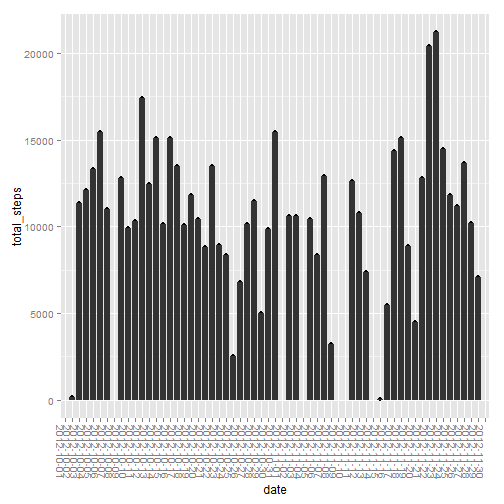
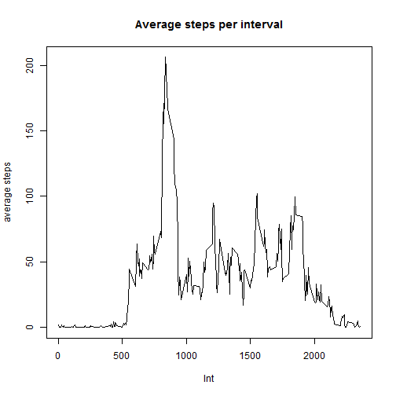
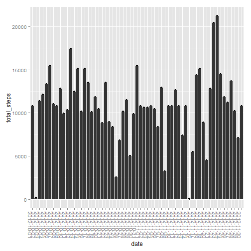
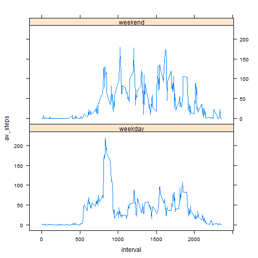

##Reproducible Reseach - Assignment 1


```r
unzip("activity.zip")
data <- read.csv("activity.csv")
library(ggplot2)
library(dplyr)

per_day <- group_by(data, date)
steps_per_day <- summarize(per_day, sum(steps))
colnames(steps_per_day) <- c("date", "total_steps")

print(qplot(date, total_steps, data=steps_per_day) + geom_histogram(stat="identity")  + theme(axis.text.x=element_text(angle = -90, hjust = 0)))
```

```
## Warning: Removed 8 rows containing missing values (position_stack).
```

```
## Warning: Removed 8 rows containing missing values (geom_point).
```

 

```r
summary(steps_per_day)
```

```
##          date     total_steps   
##  2012-10-01: 1   Min.   :   41  
##  2012-10-02: 1   1st Qu.: 8841  
##  2012-10-03: 1   Median :10765  
##  2012-10-04: 1   Mean   :10766  
##  2012-10-05: 1   3rd Qu.:13294  
##  2012-10-06: 1   Max.   :21194  
##  (Other)   :55   NA's   :8
```

The average of total steps per day is 10766 and the median is 10765.


```r
cl_data <- filter(data, !is.na(steps)) 
per_int <- group_by(cl_data, interval)
steps_ave_int <- summarize(per_int, mean(steps))
colnames(steps_ave_int) <- c("interval", "average_steps")
plot(steps_ave_int$interval, steps_ave_int$average_steps, type ="l", main="Average steps per interval", ylab="average steps", xlab="Int")
```

 

The 5-min interval containing the maximal number of steps is interval 835.


```r
bad <- is.na(data$steps)
length(bad[bad==TRUE])
```

```
## [1] 2304
```

The total number of missing values in the dataset is 2304.

As a strategy to fill missing values I chose the mean for the 5-min interval.


```r
data2 <- within(data, fsteps <- ifelse(!is.na(data$steps),data$steps,steps_ave_int$average_steps))

per_day <- group_by(data2, date)
steps_per_day <- summarize(per_day, sum(fsteps))
colnames(steps_per_day) <- c("date", "total_steps")
print(qplot(date, total_steps, data=steps_per_day) + geom_histogram(stat="identity")  + theme(axis.text.x=element_text(angle = -90, hjust = 0)))
```

 

```r
summary(steps_per_day)
```

```
##          date     total_steps   
##  2012-10-01: 1   Min.   :   41  
##  2012-10-02: 1   1st Qu.: 9819  
##  2012-10-03: 1   Median :10766  
##  2012-10-04: 1   Mean   :10766  
##  2012-10-05: 1   3rd Qu.:12811  
##  2012-10-06: 1   Max.   :21194  
##  (Other)   :55
```

After imputing missing values, the average of total steps per day is 10766 and the median is also 10766.There is a slight change in the Median, the Average didn't changed. Since we are adding the average of each interval, the impact on the total number of steps is small in the overallm but for days with high amount of missing values, the impact is big.


```r
data2 <- mutate(data2, day = weekdays(as.Date(data2$date)))
data2 <- mutate(data2, day_type = ifelse((day=="Saterday" | day=="Sunday"), "weekend", "weekday"))
per_int_day <- group_by(data2, day_type, interval)
avg <- summarize(per_int_day, av_steps=mean(fsteps))
library(lattice)
xyplot(av_steps ~ interval | day_type, data=avg, layout=c(1, 2), type="l")
```

 
